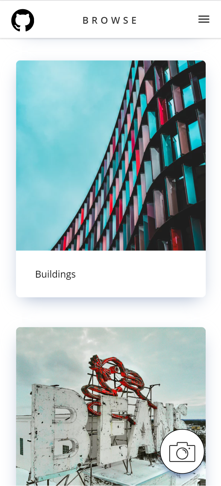

# POST LAHacks
Instagram + Reddit Web Application

<p align="center">
	
</p>

# Features
* cross-browser compatibility °˖✧◝(⁰▿⁰)◜✧˖°
* responsive design, great for your phone (ღゝ◡╹)ノ♡)
* (IMPROVEMENT IN PROGRESS) upload photos
* (IMPROVEMENT IN PROGRESS) SQL database
* (IMPROVEMENT IN PROGRESS) SQL injection protection
* (PLANNED) compression of photos (server and client)
* (IMPROVEMENT IN PROGRESS) vote on photos
* (IMPROVEMENT IN PROGRESS) account system + session tracking (via secure cookies)
* (IMPROVEMENT IN PROGRESS) view all your uploaded photos
	* lazy loading implementation
* (IMPROVEMENT IN PROGRESS) view category of photos by other users
* (IMPROVEMENT IN PROGRESS) create your own categories
* (IMPROVEMENT IN PROGRESS) signup/login input validation (server and client)
* (IMPROVEMENT IN PROGRESS) brute force token protection (server-side)
* (IMPROVEMENT IN PROGRESS) reCaptcha validation (server and client)
* (PLANNED) live-updating votes


## Stack
* Front End
	* [FilePond](https://pqina.nl/filepond/)
	* reCaptcha 2.0
	* EJS templates
* Back End
	* Node.JS and custom API
	* Google Cloud: App Engine
	* reCaptcha 2.0
	* MySQL Database
	* (PLANNED) Mozilla Session


# Installing the Project

You'll want to git clone and then change into the project directory. In any directory inside the project, call this command on the command line:
```
npm install
```

This will install all the required dependencies. We still need to start up the MySQL database where the exchanges will be happening.
```
mysqld
```
Keep the MySQL server up while the web application is running otherwise there'll be a lot of errors.

```
npm start
```
That's all the setup in one command. Take note that the `start` command also functions as a "reset". It will reset the database associated with this web application and delete all uploaded pictures.

After starting up the web server, you'll then want to go to this URL inside your browser:
```
localhost:3000
```


# Using the Test Folder Prototype

You may choose to use Python's simple HTTP server or you may use npm's live-server. As long as the servlet is able to set the root directory to be the test directory, it should be fine.

## Python
If you have python (v3.6+) you may make the following call inside the test directory:
```
python -m http.server
```
Then, just go to the port inside your web browser.

## Live-Server
Otherwise, you'll need to install [npm live-server](https://www.npmjs.com/package/live-server) first. I didn't include this in my modules since I have this globally installed for specific testing and everyone's tools are different.

Go into the test folder directory and then call:
```
live-server
```
